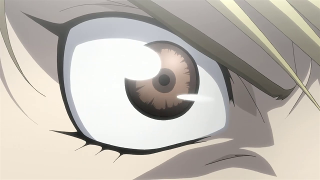
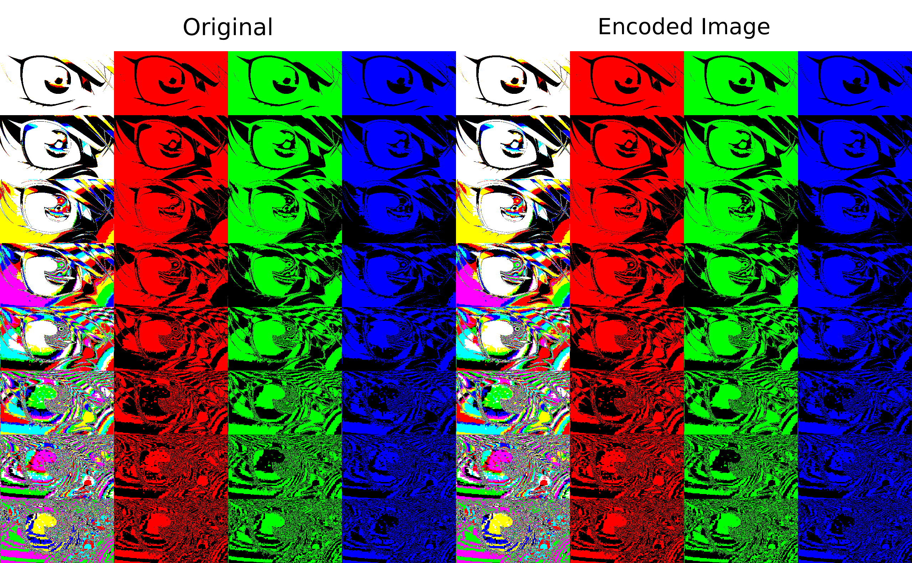

# BusySteg

> Hide information content into busy areas of images, optimally

## Basic Idea

Some parts of the image (for example, tree foliage) are busier than
others (for example, the sky). It is possible to hide upto even 4 bits
per 8 bit pixel in such areas, with no perceptible change to the
image. Additionally, such modifications are virtually impossible to
detect using common steganalysis techniques.

The original idea for this is taken from a paper
titled ["Keyless dynamic optimal multi-bit image steganography using
energetic pixels" by Goutam Paul et. al.](https://link.springer.com/article/10.1007/s11042-016-3319-0).

The implemented technique is resistant against:

1. Visual attacks
2. Analysis though quality metrics
3. Structural attacks
4. Statistical attacks

## Example

### Original Image


### Image with text hidden



In the above image, the text hidden is

> Beauty lies in the eye of the beholder

Quite a fitting caption actually.

### Bitplane analysis

A [bitplane](https://github.com/jaybosamiya/bitplanes) analysis on the image shows no visible artefacts.



## Usage

The code requires OpenCV 2.x, and CMake installed.

Compile using:

```
mkdir bin
cd bin
cmake ..
make
```

Hide data into an image using:

```
./busysteg h <image path> <data path> <output image path>
```

Extract data from the image using:

```
./busysteg x <image path> <output data path>
```

## License

[MIT License](https://jay.mit-license.org/2017)
